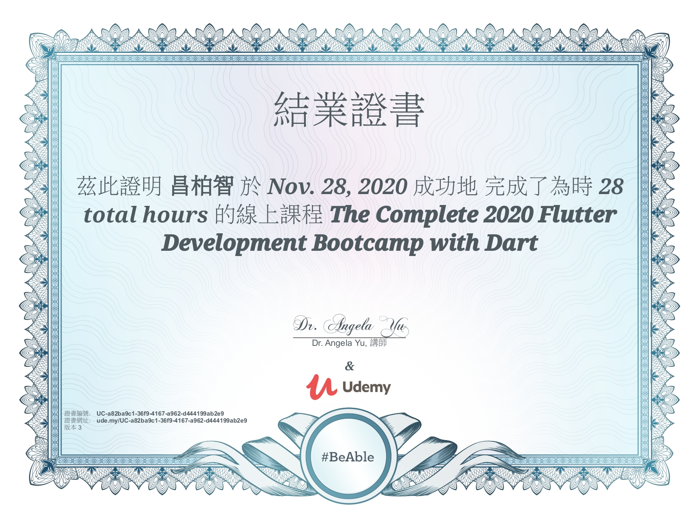

# 
Flutter-learning-process

  

This is my early learning process in contact with Flutter, I choose [Angela Yu's](https://www.udemy.com/user/4b4368a3-b5c8-4529-aa65-2056ec31f37e/) course, [The Complete 2020 Flutter Development Bootcamp with Dart](https://www.udemy.com/course/flutter-bootcamp-with-dart/#instructor-1) at Udemy as the starting point for learning Flutter.

***

## Dr Angela Yu

Lead Instructor who have been invited by companies such as Twitter, Facebook and Google to teach their employees.

## The Complete 2020 Flutter Development Bootcamp with Dart

Officially created in collaboration with the Google Flutter team.

## Self practice

* [A personal business card](https://github.com/roger7904/Flutter-learning-process/tree/main/mycard_flutter)
* [My podcast show](https://github.com/roger7904/Flutter-learning-process/tree/main/mypodcast_flutter)
* [A dice app with functionality](https://github.com/roger7904/Flutter-learning-process/tree/main/dice_flutter)
* [A quiz app that tests general knowledge](https://github.com/roger7904/Flutter-learning-process/tree/main/quiz_flutter)
* [A bmi app that provide user to calculate their bmi](https://github.com/roger7904/Flutter-learning-process/tree/main/bmi_flutter)
* [A weather app that connect api to retrieve data](https://github.com/roger7904/Flutter-learning-process/tree/main/flutter_weatherapi)
* [A currency app that connect multiple api to retrieve different data](https://github.com/roger7904/Flutter-learning-process/tree/main/flutter_coinrate_transfer)
* [A chat app that connect firebase to store and display data](https://github.com/roger7904/Flutter-learning-process/tree/main/chat_flutter)
* [A to-do list app that provide user to add and cancel tasks](https://github.com/roger7904/Flutter-learning-process/tree/main/todo_flutter)

## Course Completion Certificate

