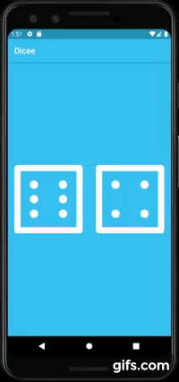

# dice_flutter

A dice app with functionality.
***

## What I learned

* How to create Stateless Widgets
* How to use Containers to lay out UI
* How to use Columns and Rows to position UI elements
* How to add custom fonts
* How to add Material icons
* How to style Text widgets

