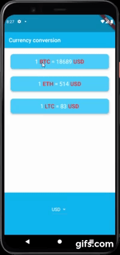

# 
currency conversion_flutter

A currency concersion app that connect multiple api to retrieve different data.
  
 
 
  

***

## What I learned

- How to use the DropdownButton Widget from Material design.
- How to use Cupertino Widgets in your app.
- How to check the platform your app is being run on to customise the UI for that platform.

