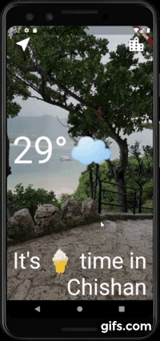

# 
weather_flutter

A weather app that connect api to retrieve data.
  
 
 
  

***

## What I learned

- How to use Flutter themes to create coherent branding.
- How to create multi-page apps using Flutter Routes and Navigator.
- How to pass functions as parameters and fields.
- How to use the GestureDetector Widget to detect more than just a tap.
- How to use custom colour palettes by using hex codes.
- How to customise Flutter Widgets to achieve a specific design style.
- Understand Dart Enums and the Ternary Operator.
- Learn about composition vs. inheritance and the Flutter way of creating custom UI.
- Understand the difference between const and final in Dart and when to use each.
