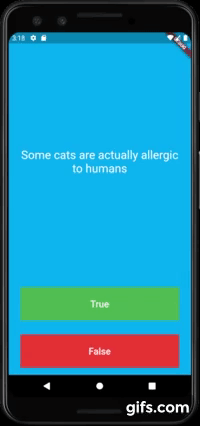

# 
 quiz_flutter

 
  

***

## What I learned

- Modularising code into separate classes.
- Dart classes and objects.
- Using class constructors.
- Extracting Widgets to refactor code.
- private and public modifiers in Dart.
- How to use Dart lists.
