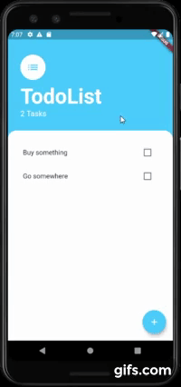

# 
todo_flutter

A to-do list app that provide user to add and cancel tasks.
  
 
 
  

***

## What I learned

- Understand what is state and why we need to manage it.
- Understand the difference between ephemeral (local) state and app state.
- Learn about the concept of Prop Drilling.
- Examine various popular ways of managing app state for Flutter projects.
- Learn about the List Builder.
- Use the Flutter BottomSheet Widget.
- Learn to lift state up to be able to access it from children widgets.
- Learn about design patterns and why they are useful.
- Understand how the **Provider** package works and use it to manage app state.
